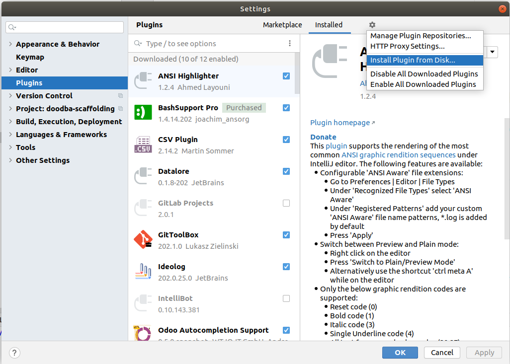
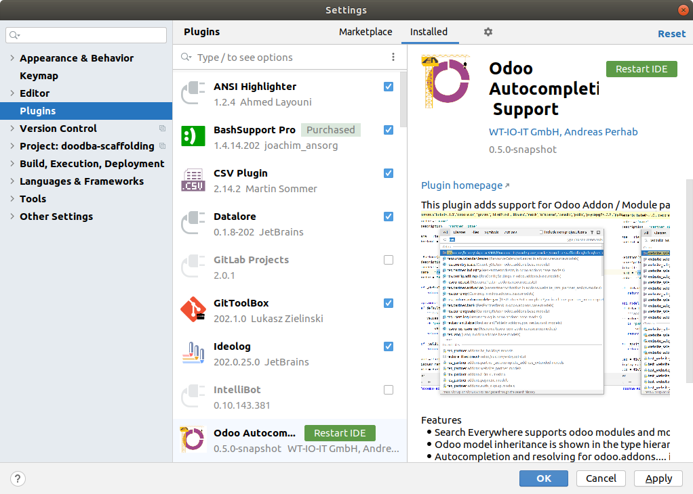

# Installing

The Plugin will be made available in the [JetBrains Plugin Repository](https://plugins.jetbrains.com/plugin/13083-odoo-support-for-pycharm)

Alternatively you can install it as a local file
* Download [odoo_plugin.jar](odoo_plugin.jar)
* In PyCharm in File > Settings > Plugin select the gear icon.
* Select install plugin from disk and choose the downloaded odoo_plugin.jar

# Contributing

## Checkout and open Odoo Autocompletion Plugin in IntelliJ IDEA

1. git clone https://github.com/wt-io-it/odoo-pycharm-plugin.git into a directory
1. Open a new project by selecting File > New > Project from Version Control > Git
1. Enter `https://github.com/wt-io-it/odoo-pycharm-plugin.git` into the Field URL
   
1. Start coding

## Agreement to publish the code in the Jetbrains Plugin Repository 

By contributing you agree that this plugin is also published in the JetBrains Plugin Repository under the terms of the
JetBrains Plugin Marketplace Developer Agreement

# Development HowTos
## Build Plugin
To build the plugin perform the following steps
* checkout the version you want to build
* run `./gradlew buildPlugin`
## Install Development Version of the Plugin
> Development versions are marked with -SNAPSHOT
* Build the plugin as descriped above
* In PyCharm / IntelliJ open File > Settings
* Select Plugins
* Select the gear icon above the plugin list and select "Install Plugin from Disk ..."

* Select the plugin jar file from [build/libs](build/libs) directory and click "OK"
* Click the "Restart IDE" button to apply the new version of the plugin:

## Publish a new version
* test plugin with `./gradlew test`
* test plugin manually by installing it
* review changelog
* change -SNAPSHOT version to non snapshot version and perform release commit
* verify the plugin with `./gradlew verifyPlugin`
* submit plugin to jetbrains review process with `./gradlew publishPlugin`
* tag commit as version with `vN.N.N`
* push commit and tag
* prepare version numbers for next version and commit
* push commit